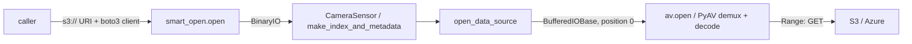

# Using the Sensor Library with Cloud Storage

The sensor library is backend-agnostic: it does **not** accept cloud URIs and
does **not** import any cloud SDK. Callers feed data from S3, Azure Blob, GCS,
or any other remote store by opening their own seekable `BinaryIO` and passing
it as the `io.BufferedIOBase` arm of `DataSource`.

For measured I/O behavior (bounded-read claims, parity, latency
characteristics), see
[`docs/curator/design/sensor-library-cloud-storage.md`](../design/sensor-library-cloud-storage.md).

## Supported `DataSource` shapes

`DataSource` (in `cosmos_curator/core/sensors/types/types.py`) is the union
`Path | bytes | io.BufferedIOBase`. Dispatch lives in
`cosmos_curator/core/sensors/utils/io.py::open_file`.

| Shape                | Use for                                                                 |
| -------------------- | ----------------------------------------------------------------------- |
| `pathlib.Path`       | Local filesystem reads. Library owns the handle.                        |
| `bytes`              | Owned in-memory bytes. Wrapped in `io.BytesIO` per call.                |
| `io.BufferedIOBase`  | **Any** caller-owned binary stream — local files, S3, Azure, GCS, etc.  |

Any other type (including `str` URIs) raises `ValueError` at `open_file`.

The `io.BufferedIOBase` stream must be **readable** and **seekable**. The
library treats it as an absolute-offset random-access buffer: each public
sensor entry point positions the stream at offset 0 before handing it to
PyAV / PIL, the underlying decoder performs absolute seeks within it, and the
library does **not** restore the caller's position on exit.

## Wrapping cloud objects as `BinaryIO`

The recommended path is `smart_open` because it produces a seekable `BinaryIO`
backed by HTTP range requests, which is exactly what bounded-read indexing
(`make_index_and_metadata(..., FROM_HEADER)`) requires. Callers must supply
their own authenticated SDK client through `transport_params` — the sensor
library never reads AWS / Azure credentials by itself.



For projects that already build a `StorageClient` (S3 or Azure) through
`cosmos_curator.core.utils.storage`, the convenience helper
`storage_utils.get_smart_open_client_params` returns the right
`transport_params` dict to feed into `smart_open.open`.

End-to-end example for S3:

```python
import smart_open
from cosmos_curator.core.utils.storage import s3_client, storage_utils
from cosmos_curator.core.sensors.sensors.camera_sensor import CameraSensor

client = s3_client.create_s3_client("s3://my-bucket/", profile_name="default")
transport_params = storage_utils.get_smart_open_client_params(client)

with smart_open.open("s3://my-bucket/path/to/clip.mp4", "rb", **transport_params) as stream:
    sensor = CameraSensor(stream)
    for batch in sensor.sample(spec):
        ...
```

The same shape works for `az://` URIs with
`azure_client.create_azure_client(...)`. Callers that don't use the in-house
`StorageClient` abstraction can plug in any boto3 / azure-storage-blob /
google-cloud-storage client directly:

```python
import boto3, smart_open
from cosmos_curator.core.sensors.utils.video import make_index_and_metadata

s3 = boto3.Session(profile_name="default").client("s3")
with smart_open.open("s3://bucket/clip.mp4", "rb", transport_params={"client": s3}) as stream:
    index, metadata = make_index_and_metadata(stream)
```

`BinaryIO` is accepted by every public sensor entry point:

- `make_index_and_metadata(source, ...)`
- `CpuVideoDecoder.open(source, ...)` / `GpuVideoDecoder.open(source, ...)`
- `CameraSensor(source, ...)`
- `ImageSensor([source, ...], ...)`

## Multi-phase usage and stream reuse

Some workflows construct a `CameraSensor` and then call `.sample()` one or more
times — index build and decode go through the **same** `BinaryIO`. This is
supported because each sensor entry point seeks the stream to 0 before calling
PyAV. The trade-off vs. opening a fresh `BinaryIO` per phase is that the
single-stream lifecycle issues one HTTP connection family per phase (`smart_open`
reuses connections within a stream); cold-start latency may differ from the
old two-open lifecycle. See the design doc for measured numbers.

Workflows that need truly independent streams across phases should simply open
the URI twice with `smart_open.open(...)` — one stream per call:

```python
with smart_open.open(uri, "rb", **transport_params) as s1:
    index, metadata = make_index_and_metadata(s1)

with smart_open.open(uri, "rb", **transport_params) as s2:
    with CpuVideoDecoder.open(s2) as decoder:
        ...
```

## Gotchas

- **No URI auto-discovery.** The library does not auto-discover credentials
  and does not parse URI schemes. Wrap your remote object as a `BinaryIO` on
  the caller side.
- **Streams must be seekable.** Non-seekable streams (raw
  `urllib.urlopen` responses, `boto3 StreamingBody` without buffering, etc.)
  are rejected with a `ValueError` at `open_data_source`. Either wrap them in
  `io.BytesIO`, download to a local `Path`, or use `smart_open` which exposes a
  seekable view backed by HTTP range requests.
- **Profile discovery differs by backend.** `S3Client` honours
  `boto3.Session(profile_name=...)` plus the standard AWS credential chain.
  `AzureClient` reads `${COSMOS_AZURE_PROFILE_PATH:-/dev/shm/azure_creds_file}`
  then falls back to NVCF secrets — there is no AWS-style env-var fallback.
- **Per-seek HTTP latency dominates on object stores.** `smart_open` issues a
  fresh `GetObject` on every `seek()`. For seek-heavy workloads (per-frame
  sampling, repeated `sample()` calls) wall time scales with seek count × RTT,
  not file size. See the design doc's "Limitations" for measured numbers and
  the connection-pooling follow-up.
- **One stream per concurrent reader.** Concurrent / overlapping use of the
  same `BinaryIO` from multiple sensors (or interleaved sensor calls) is
  unsupported. Open a fresh stream per concurrent reader.
